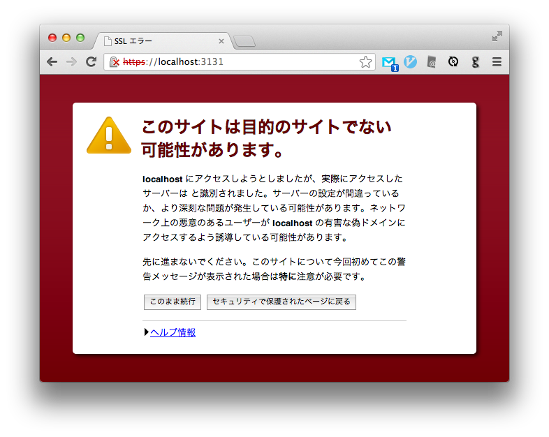

# Ummmmm

## description

dotjs + chrome setup script

## require

* [defunkt/dotjs · GitHub](https://github.com/defunkt/dotjs)
* [cliclick v2 or later](http://www.bluem.net/de/mac/cliclick/)

## usage

* run prepare\_dotjs\_chrome.app (compile prepare\_dotjs\_chrome.applescript)
* run with shellscript

        $ osascript /path/to/prepare_dotjs_chrome.applescipt
        or 
        $ sh prepare_dotjs.sh
    
* set prepare\_dotjs\_chrome.app to login item for auto setup